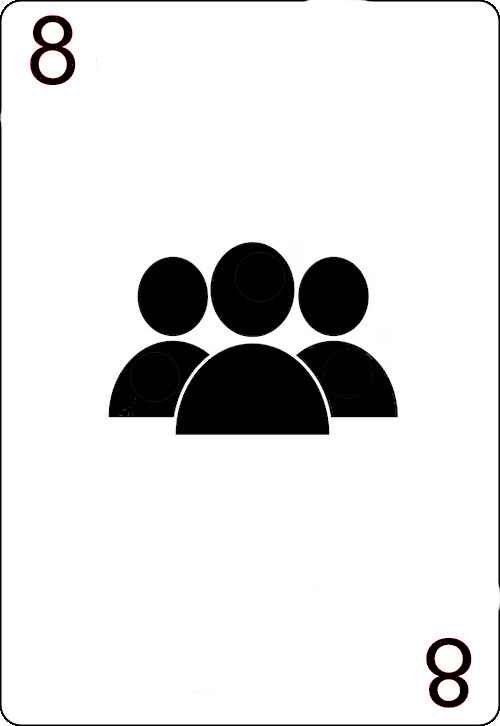

# Card Game Rules and Instructions

This card game is played with 36 cards, consisting of 4 suits {"♦", "♠", "♥", "♣"} and ranks ranging from {"6", "7", "8", "9", "10", "J", "Q", "K", "A"}. The game can be played by 3 players. Player 1 will play against 2 AI players. Each player starts with 5 cards. Below are the detailed rules and controls of the game.

## Game Rules

### Starting the Game
- **Initial Setup**: Each player starts with 5 cards.
- **First Move**: Player 1 puts a card onto the stack and can add more cards with the same rank. The next player can play a card with the same suit or the same rank and can also add more cards with the same rank.

### Playing a Turn
- **Using Hand Cards**: Initially, the cards on hand must be used, and at least one card must be played.
- **Drawing from the Blind**: If a player does not hold a suitable card, they must draw one card from the blind. This card can be played if it matches the card on the stack. If it does not match, the next player continues.

### Special Conditions
- **Drawing Cards**: No more than one card can be drawn from the blind, except when a '6' is placed on the stack.
- **Covering a '6'**: A '6' must always be covered by another rank. If no suitable card is in the player's hand, they must draw cards from the blind until the '6' is covered.

## Special Cards
- **6**: Must be covered by a different rank. The player can draw cards until they cover the '6'.
- **7**: The next player must draw one card from the blind.
- **8**: The next player must draw 2 cards and will be passed over. Multiple '8's can either force the next player to draw 2 cards for each '8' or distribute the draw among following players.
- **J**: Can be played to any suit. The player chooses the suit that must follow.
- **A**: The next player is passed over. Multiple Aces skip sequential players.

## 'Qute' Condition
If four cards of the same rank are played in a row, the player who plays the fourth card can choose to end the round.

- **'Qute' with '6'**: Overrides the '6 must be covered' rule.

## Scoring
- **End of Round**: Scoring occurs when a player has no more cards or a 'Qute' is announced.

### Card Values:
- 6: 0 points
- 7: 0 points
- 8: 0 points
- 9: 0 points
- 10: 10 points
- J: 20 points (-20 for finishing with J)
- Q: 10 points
- K: 10 points
- A: 15 points

### Special Counting 'J'
- **Finishing with 'J'**: The score is either reduced by 20 points for each 'J' played by the last player or increased by 20 points for other players.
- **A player has exactly 125 Points**: His score resets to 0.
- **Empty Blind**: The stack is reshuffled, and points are doubled for the round.

## Game Control

### Mouse Controls
- **Click on card**: Put card on stack if the card fits to the stack.
- **Right Click on**: next player's turn
- **Toggle decisions**: Various in-game decisions for 8's, J's and 'Qute'

### Decisions
- **multiple 8**: Decide how the draw cards rule for multiple 8 will apply.

- **J Suit**: Choose the suit to follow a 'J'.
- **J Points**: Choose between reducing your score or increasing others' scores.
- **'Qute'**: Decide whether to finish or continue the round.

### Special Keys (Testing Mode)
- **v**: Toggle visibility of other players' cards.
- **6, 7, 8, J, A**: Add a corresponding card to the active player's hand.

Enjoy the game!
