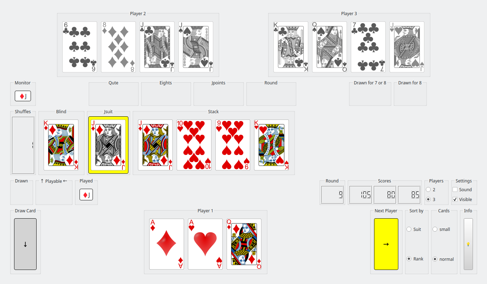

---
<center><span style="font-size: 36px; font-weight: bold;">a Qute Card Game</span></center>

--- 

This card game is played with a deck of 36 cards, consisting of 4 suits: {"♦", "♠", "♥", "♣"} and 9 ranks: {"6", "7", "8", "9", "10", "J", "Q", "K", "A"}.
The game supports 2 or 3 players, with Player 1 competing against 1 or 2 AI opponents.

Objective
The goal of the game is to achieve a final score lower than the scores of all other players. The game is played in multiple rounds, with each round ending when a player runs out of cards. At the end of each round, the points from the remaining cards of the other players are counted and added to their scores.

The game ends when any player's score exceeds 125 points.

Default Configuration
By default, the game is set up for 3 players.

Below, you will find details about the gameboard layout, rules, controls, and instructions for compiling and running the game.
---

## Gameboard Layout 

1. **Top Row**: Displays the 2 opponent AI players (Player 2 and Player 3). When playing against only 1 opponent, the panel for player 3 is hidden.

2. **Second Row**: Contains the **Monitor** (shows cards of the same rank played in sequence), various choosers (**Qute Chooser**, **Eights Chooser**, **Jpoints Chooser**, and **Round Chooser**), and panels for 'Cards drawn for 7 or 8' and for 'Cards drawn for 8'. 

   - *Cards drawn for 7s or 8s*: Cards are shown **'enabled'** if the active player drew cards due to one or more sevens played by the previous player. Cards are shown **'disabled'** if they were drawn for eights, indicating players' turns were skipped.
   - *Cards drawn for 8s*: Cards are shown **disabled** because they were drawn for eights, indicating players' turns were skipped. This panel is hidden when playing against only one opponent.

3. **Third Row**: Includes the **Shuffles counter** (indicates how often the blind was refilled and shuffled), the **Blind** (shows the top card of the draw pile), the **JsuitChooser** (to choose which suit follows a 'J'), and the **Stack** (recently played cards).

4. **Fourth Row**: Indicators for cards drawn (except cards drawn for 7s and 8s) (Drawn), playable cards that fit the actual card on the stack (Playable), cards played by the current player (Played).

   This row shows an indicator for the rounds played, and the player scores.
   Furthermore, there are radiobuttons for the number of players (Players) and how to sort the hand deck (Sort Cards by) as well as checkboxes for some sound effects and whether or not the card faces of the opponent's hand deck are visible (Settings).

5. **Bottom Row**: Contains your own hand of cards (Player 1). When it is your turn, just click on a playable card to put it on the stack.

---

<div style="page-break-before: always;"></div>

---
### Layout on Android device:


In this scenario:

Player 3 plays two cards of rank '8' onto the stack.
Decision:
Player 1 must draw 2 cards, and their turn is skipped.
Player 2 must also draw 2 cards, and their turn is skipped as well.
As a result, Player 3 becomes the active player again.

---

<div style="page-break-before: always;"></div>

---

### Layout with card faces of opponent players not visible (3 players):



Scenario: 'QUTE' Condition with 'J's

Player 1 has played a 'J', resulting in four 'J's played in a row (not necessarily by the same player). This triggers the 'QUTE' condition.

Decisions Available
QUTE or CONTINUE
and
PLUS or MINUS

QUTE: End the round and count the points.
CONTINUE: Proceed with the current round without ending it.
PLUS or MINUS (if QUTE is chosen)

PLUS: Increase the scores of other players by 20 points for each 'J' played during this round.
MINUS: Reduce the active player's score by 20 points for each 'J' they played.
Controls
'QUTE/CONTINUE' Button: Toggles the decision between ending the round or continuing.
'PLUS/MINUS' Button: Toggles the scoring method if the round ends.
'FINISH' Button: Confirms the decisions and finalizes the round's outcome.
Outcome
Once 'FINISH' is pressed:

If QUTE is selected, points are counted based on the chosen PLUS/MINUS rule.
If CONTINUE is selected, the game proceeds as normal.

---

<div style="page-break-before: always;"></div>

---
## Game Rules

### Starting the Game
- **Initial Setup**: Each player starts with 5 cards.
- **First Move**: Player 1 plays a card onto the stack and may add more cards of the same rank.  
  The next player must play a card of the same suit or rank and may also add more cards of the same rank.

---

### Playing a Turn
- **Using Hand Cards**: Players must play at least one card from their hand.
- **Drawing from the Blind**: If no suitable card is available in hand, the player draws one card from the blind.  
  - If the drawn card matches the stack, it can be played.  
  - Otherwise, the turn passes to the next player.

---

### Special Conditions
- **Drawing Cards**: Only one card can be drawn from the blind, except when covering a '6'.
- **Covering a '6'**:  
  - A '6' must be covered by a different rank.  
  - If no suitable card is available in hand, cards are drawn from the blind until a non-'6' card can be played.  
  - The 'Qute' condition (four cards of the same rank played in sequence) overrides this rule, allowing the player to either end the round or cover the fourth '6' with another rank.

---

### Special Cards
- **6**: Must be covered by a different rank. Draw cards until this is possible.
- **7**: The next player must draw one card from the blind.
- **8**:  
  - The next player must draw 2 cards and is skipped.  
  - Multiple '8's force the next player to draw 2 cards per '8' or distribute the draws among following players.  
  - If distributed, these players are also skipped (decided via the 'Eights Chooser').  
- **J**: Can be played on any suit. The player chooses the suit to follow using the 'JsuitChooser'.
- **A**: The next player is skipped. Multiple Aces skip sequential players.

---

### 'Qute' Condition
- When four cards of the same rank are played in sequence (by different players), the player who plays the fourth card can choose to:  
  1. End the round.  
  2. Continue the game.  
- Four '6's {"6♦", "6♠", "6♥", "6♣"} with 'Qute' enabled override the 'a 6 must be covered' rule.

---

## Scoring
- **Rounds**: The game consists of multiple rounds.
- **Round End**: A round ends when a player has no more cards or a 'Qute' is announced.
- **Scoring**: Points from remaining cards are added to each player's score at the end of a round.
- **Game End**: The game ends when a player scores over 125 points.  
  - The winner is the player with the lowest score.  
- **Next Round**: The player with the highest score starts the next round.

---

### Card Values
- **6, 7, 8, 9**: 0 points  
- **10, Q, K**: 10 points  
- **J**:  
  - -20 for the player or +20 for opponents if the round ends with a 'J' on top of the stack (decided via 'Jpoints Chooser').  
- **A**: 15 points  

---

### Special Scoring Rules
- **125 Points Reset**: A player's score resets to 0 if they reach exactly 125 points.
- **Finishing with 'J'**:  
  - Players can choose to reduce their score by 20 points per 'J'.  
  - Alternatively, increase opponents' scores by 20 points per 'J'.  
- **Refilled Blind**:  
  - Each refill of the blind multiplies the end-of-round points (doubling, tripling, etc.).  
  - This includes the +/-20 points rule when finishing with 'J'.

---

## Game Control

### Mouse Controls
- **Click on card**: Play the card onto the stack if it matches.  
- **Click on Choosers**: Toggle decisions for 'Jsuit' , 'QUTE/CONTINUE', 'ALL/NEXT', 'PLUS/MINUS'.
- **Click on FINISH**: Round finished. Points are counted.
- **Click on Button →**: Activate next player.
- **Click on Button ↓ **: Draw a card (if player must draw a card).


---

### More Controls and Settings


- **Players**: Choose to play against 1 or 2 AI opponents
- **Sound**: Enable or disable sound effects. 
- **Visible**: Toggle the visibility of AI players' card faces
  *(The checkbox is unset when a new round starts.)*
- **Sort by**: Arrange your hand cards by suit or rank
    *(This resets to 'Unsorted' when a card is drawn from the blind.)*  
- **Cards**: small cards or normal cards
---

### Special Keys for Testing

- **CTRL + [6, 7, 8, 9, T, J, Q, K, A]**: Add corresponding cards (of all suits) to the active player's hand.

---

<div style="page-break-before: always;"></div>

---

### How to Install

1. **Try a precompiled version**

2. **Or compile yourself**:  
   - **Install Git** (if not already installed).  
   - **Clone the Repository**:  
     `bash
     git clone https://github.com/squawk7x/aQuteCardGame.git
     ```  
   - **Install Qt Creator** (if not already installed).  
   - **Open the Project**:  
     In Qt Creator, navigate to the 'aQuteCardGame' directory and open `CMakeLists.txt`.  
   - **Compile and Run**:  
     Press `Ctrl+R` or click the green arrow in Qt Creator to build and start the game.

---

<center><span style="font-size: 36px; font-weight: bold;">Enjoy The Game!</span></center>

---
