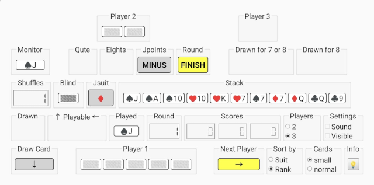
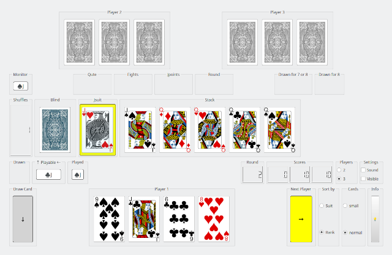

---
# a Qute Card Game

--- 

--- 

---
## Game Rules

This card game is played with a deck of 36 cards, consisting of 4 suits: {"♦", "♠", "♥", "♣"} and 9 ranks: {"6", "7", "8", "9", "10", "J", "Q", "K", "A"}.
The game supports 2 or 3 players, with Player 1 competing against 1 or 2 AI opponents.

Objective
The goal of the game is to achieve a final score lower than the scores of all other players. The game is played in multiple rounds, with each round ending when a player runs out of cards. At the end of each round, the points from the remaining cards of the other players are counted and added to their scores.

The game ends when any player's score exceeds 125 points or if a player decides for 'Qute' (this is when 4 cards with same rank appear in a row).

Below, you will find details about the game rules, gameboard layout, controls, and instructions for compiling and running the game.

---

### Starting the Game
- **Initial Setup**: Each player starts with 5 cards.
- **First Move**: Player 1 plays a card onto the stack and may add more cards of the same rank.  
  - The next player must play a card of the same suit or rank and may also add more cards of the same rank.

---

### Playing a Turn
- **Using Hand Cards**: Players first attempt to play a card from their hand that matches the stack card in suit or rank.  
  - If a matching card is available, the player must play at least one.  
  - They may then choose to play additional cards of the same rank but are not required to do so.  
  - If no matching card is available, the player must draw from the blind.

- **Drawing from the Blind**: If no suitable card is available in hand, the player draws one card from the blind.  
  - If the drawn card matches the stack, it must be played immediately.  
  - If it does not match, the player's turn ends, and the next player takes their turn.

---

### Special Conditions
- **Drawing Cards**: Only one card can be drawn from the blind, except when covering a '6'.
- **Covering a '6'**:  
  - A '6' can be covered by another '6' and finally must be covered by a different rank.  
  - If no suitable card is available in hand, cards are drawn from the blind until a non-'6' card can be played.  
  - Only the **'Qute' condition** (four cards of the same rank played in sequence) overrides this rule, allowing the player to either:
    - End the round, or  
    - Continue the round by covering the fourth '6' with another rank.

---

### Special Cards
- **6**: Must be covered by a different rank. Draw cards until this is possible.
- **7**: The next player must draw one card from the blind.
- **8**: When an 8 is played:  
  - The next player must draw 2 cards and is skipped.  
  - Multiple '8's force the next player to draw 2 cards per '8' or distribute the draws among following players.  
  - If distributed, these players are also skipped. The distribution is decided via the **'Eights Chooser: ALL/NEXT'**.  
- **J**: Can be played on any suit. The player chooses the suit to follow using the **'JsuitChooser: "♦", "♠", "♥", "♣"'**.  
- **A**: The next player is skipped. Multiple Aces skip sequential players.

---

---

### 'Qute' Condition
- When four cards of the same rank are played in sequence (by different players), the player who plays the fourth card can choose to:
  - Finish the round or continue the game.
- This decision is made by the **'Qute Chooser: QUTE/CONTINUE'**.
- Four '6's **{"6♦", "6♠", "6♥", "6♣"}** and with **'Qute'** enabled overrides the **'a 6 must be covered'** rule.

---
## Scoring
- **Rounds**: The game consists of multiple rounds.
- **Round End**: A round ends when a player has no more cards or 'Qute' is announced.
- **Scoring**: Points from remaining cards are added to each player's score at the end of a round.
- **Next Round**: The player with the highest score starts the next round.

- **Game End**: The game ends when a player scores over 125 points.
  - The winner is the player with the lowest score.

---

### Special Scoring Rules
- **125 Points Reset**: A player's score resets to 0 if they reach exactly 125 points.
- **Finishing with 'J'**:  
  - Players can choose to reduce their score by 20 points per 'J'.  
  - Alternatively, players can increase opponents' scores by 20 points per 'J'.
  - This is decided via **'Jpoints Chooser: MINUS/PLUS'**.
- **Refilled Blind**:  
  - Each refill of the blind multiplies the end-of-round points (doubling, tripling, etc.).  
  - This includes the +/-20 points rule when finishing with 'J'.

---

### Card Values
- **6, 7, 8, 9**:           0 points
- **10, Q, K**:            10 points
- **A**:                   15 points
- **J**:                +20/-20 points 

When the blind was **shuffled** one or more times, the points of this round will be doubled, trippled ...

---

---
## Gameboard Layout 

1. **Top Row**: Displays the 2 opponent AI players (Player 2 and Player 3). When playing against only 1 opponent, the panel for player 3 is hidden.

2. **Second Row**: Contains the **Monitor** (shows cards of the same rank played in sequence), various choosers (**Qute Chooser**, **Eights Chooser**, **Jpoints Chooser**, and **Round Chooser**), and panels for 'Cards drawn for 7 or 8' and for 'Cards drawn for 8'. 

   - *Cards drawn for 7s or 8s*: Cards are shown **'enabled'** if the active player drew cards due to one or more sevens played by the previous player. Cards are shown **'disabled'** if they were drawn for eights, indicating players' turns were skipped.
   - *Cards drawn for 8s*: Cards are shown **disabled** because they were drawn for eights, indicating players' turns were skipped. This panel is hidden when playing against only one opponent.

3. **Third Row**: Includes the **Shuffles counter** (indicates how often the blind was refilled and shuffled), the **Blind** (shows the top card of the draw pile), the **JsuitChooser** (to choose which suit follows a 'J'), and the **Stack** (recently played cards).

4. **Fourth Row**: Indicators for cards drawn (except cards drawn for 7s and 8s) (Drawn), playable cards that fit the actual card on the stack (Playable), cards played by the current player (Played).

   This row shows an indicator for the rounds played, and the player scores.
   Furthermore, there are radiobuttons for the number of *Players* and checkboxes for *Sound* effects and whether or not the card faces of the opponent's hand deck are *visible*.

5. **Bottom Row**: Contains your own hand of cards (Player 1). When it is your turn, just click on a playable card to put it on the stack. Furthermore, there are radiobuttons for *Sort by* (suit or rank) and radiobuttons for *Card type* (small cards for *Android* or normal cards for *Desktop*).
Finally there is an *Info* button to display this README file.
---

## Game Control

### Mouse Controls
- **Click on Card**: Play the card onto the stack if it matches.  
- **Click on Button →**: Activate next player.
- **Click on Button ↓**: Draw a card (if player must draw a card).
- **Click on Choosers**: Toggle decisions for '"♦", "♠", "♥", "♣"' , 'QUTE/CONTINUE', 'ALL/NEXT', 'PLUS/MINUS'.
- **Click on FINISH**: Finish round, count points and add points to score.
- **Click on GAME**: Start a new game.

### Keyboard Controls

         4 QUTE       5 EIGHTS    6 JPOINTS
         1 TOGGLE     2 PLAY      3 NEXT / FINISH / ROUND / GAME
                      0 DRAW

- **NUM 2**: Play the card onto the stack if it matches. The leftmost card in field *Playable* will be played.
- **NUM 3**: Activate next player.
- **NUM 0**: Draw a card (if player must draw a card).
- **NUM 1**: Toggle playable cards. The leftmost card will be added to the stack when played.
- **NUM 1**: Toggle decisions for '"♦", "♠", "♥", "♣"'.
- **NUM 4**: Toggle decisions for Qute Chooser 'QUTE/CONTINUE'.
- **NUM 5**: Toggle decisions for Eights Chooser 'ALL/NEXT'.
- **NUM 6**: Toggle decisions for Jpoints Chooser 'PLUS/MINUS'.
- **NUM 3**: Finish round, count points and add points to score.
- **NUM 3**: Start a new game.

---

### More Controls and Settings

- **Players**: Toggle to play against 1 or 2 AI opponents.
- **Sound**: Enable or disable sound effects. 
- **Visible**: Toggle the visibility of AI players' card faces.
  *(The checkbox is unset when a new round starts.)*
- **Sort by**: Toggle arranging your hand cards by suit or rank. *(Cards become unsorted when drawn from the blind.)*  
- **Cards**: Toggle small or normal cardfaces.
---

### Special Keys for Testing

- **CTRL + [6, 7, 8, 9, T, J, Q, K, A]**: Add corresponding ranks (of all suits) to the active player's hand.

---

---

### How to Install

1. **Try a precompiled version**

2. **Or compile yourself**:  
   - Install **Git** (if not already installed).  
   - Clone the Repository: git clone https://github.com/squawk7x/aQuteCardGame.git
   - Install **Qt Creator** (if not already installed).  
   - In Qt Creator, navigate to the 'aQuteCardGame' directory and open 'CMakeLists.txt'.  
   - Compile and Run: Press 'Ctrl+R' or click the green arrow in Qt Creator to build and start the game.

---

# Enjoy The Game!

---
