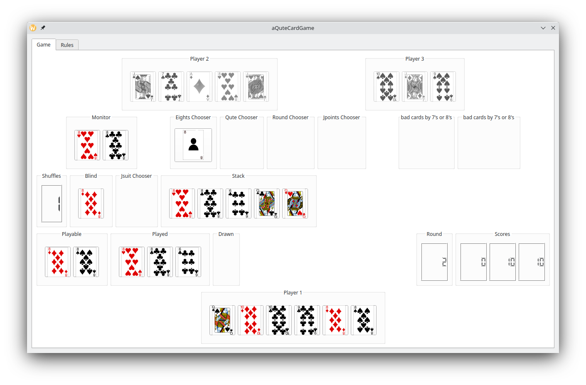
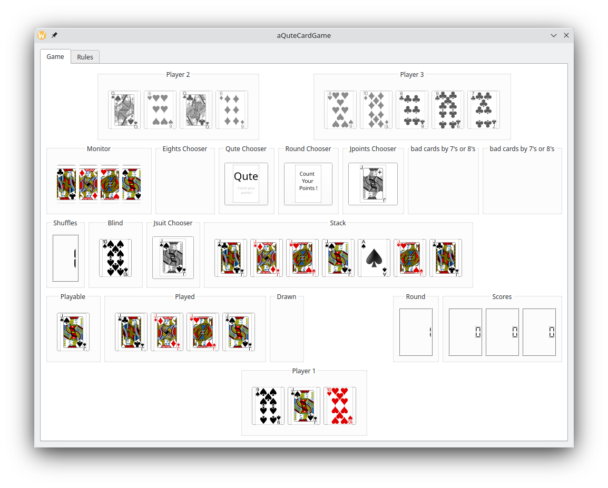

# Card Game

This little card game is played with 36 cards, consisting of 4 suits {"♦", "♠", "♥", "♣"} and ranks ranks from {"6", "7", "8", "9", "10", "J", "Q", "K", "A"}. The game is played by 3 players. Player 1 will play against 2 'AI' players. Each player starts with 5 cards. Below are the description of the gameboard layout, the detailed rules, and how to control the game flow.

## Gameboard Layout

- **First Row**: Displays the 2 opponent 'AI' players ('Player 2' and 'Player 3').
- **Second Row**: Contains the 'Monitor' (it shows the cards with the same rank played in sequence - may be played by different players), different choosers ('Eights Chooser', 'Qute Chooser', 'Round Chooser' and 'Jpoints Chooser') to react to different situations during the game flow, and panels for the cards that players had to draw due to the 'Bad cards' '7' or '8'.
- **Third Row**: A counter 'Shuffles' indicates how often the blind was refilled from the stack and shuffled, the 'Blind' (just showing the upper card which might be drawn next time a card has to be drawn), the 'JsuitChooser' (to choose which suit has to follow a 'J') and the 'Stack' (the played cards, shortened to a few of last cards played).
- **Fourth Row**: Indicators for cards of the active player's handdeck that fit to the stack ('Playable'), for cards that have been played by the actual player ('Played'), and for cards that had to be drawn in case the player had to draw (except drawings for '7's and '8's). Additionally, an indicator of the rounds played in the game and the counters for the players scores.
- **Bottom Row**: Contains your own handdeck.

## Game Rules

### Starting the Game
- **Initial Setup**: Each player starts with 5 cards.
- **First Move**: Player 1 puts a card onto the stack and can add more cards with the same rank. The next player can play a card with the same suit or the same rank and can add more cards with the same rank.

### Playing a Turn
- **Using Hand Cards**: Initially, the cards on hand must be used, and at least one card must be played.
- **Drawing from the Blind**: If a player does not hold a suitable card, they must draw one card from the blind. This card can be played if it matches the card on the stack. If it does not match, the next player continues.

### Special Conditions
- **Drawing Cards**: No more than one card can be drawn from the blind, except when a '6' is placed on the stack.
- **Covering a '6'**: A '6' must always be finally covered by another rank. If no suitable card is in the player's hand, they must draw cards from the blind until the '6' may be covered. The exception to this rule is the 'Qute' condition (4 times played same rank in sequence). In this case, the player can choose to continue and cover finally the 4th '6' with another rank or to finish the round. The decision is made by clicking on the 'Qute Chooser'.

## Special Cards
- **6**: Must be covered by a different rank. The player must draw cards until the '6' can be covered.
- **7**: The next player must draw one card from the blind.
- **8**: The next player must draw 2 cards and will be passed over. Multiple '8's can either force the next player to draw 2 cards for each '8' or distribute the draw among following players. How to distribute the multiple '8's is chosen by clicking on the 'Eights Chooser'.
- **J**: Can be played to any suit and the player chooses the suit that must follow by clicking on the 'Jsuit Chooser'.
- **A**: The next player is passed over. Multiple Aces skip sequential players.

## 'Qute' Condition
- If four cards of the same rank are played in sequence (may be and probably by different players), the player who plays the fourth card can choose to end the round or to continue the round.

- 'Qute' with '6'**: Overrides the '6 must be covered' rule.

## Scoring
- **End of Round**: Scoring occurs when a player has no more cards or a 'Qute' is announced.

### Card Values:
- 6: 0 points
- 7: 0 points
- 8: 0 points
- 9: 0 points
- 10: 10 points
- J: 20 points (-20 or +20 for each 'J' when finishing with 'J')
- Q: 10 points
- K: 10 points
- A: 15 points

### Special Counting and 'J' points
- **A player has exactly 125 Points**: Their score resets to 0.
- **Finishing with 'J'**: Either the actual players' score is reduced by 20 points for each 'J' played by the actual player or the scores of the opponent players are increased by 20 points for each 'J' played by the actual player. The actual player can decide by clicking on the 'JpointsChooser' how to count (-20 or +20 points).
- **Refilled Blind**: The stack cards are reshuffled (except last card added to the stack). Each refill of the blind doubles, tripples, ... the points when counting at the end of this round. This doubling (trippling, ...) of points also applies to the +/-20 rule when finishing a round with 'J'.

## Game Control

### Mouse Controls
- **Click on card**: Put card on stack if the card fits to the stack.
- **Right Click**: Next player's turn.
- **Toggle decisions**: Various in-game decisions for 'multiple 8', 'Jsuit', 'Jpoints', and 'Qute' by clicking on the appropriate chooser.

### Decisions
- **multiple 8**: Decide how the draw cards rule for multiple 8 will apply:

- **J Suit**: Choose the suit to follow a 'J':

- **J Points**: Choose between increasing scores of opponent players or reducing score of active player:

- **'Qute'**: Decide whether to finish or continue the round:

### Special Keys (Testing Mode)
- **v**: Toggle visibility of other players' cards.
- **6, 7, 8, J, A**: Add a corresponding card to the active player's hand.

Enjoy the game!
