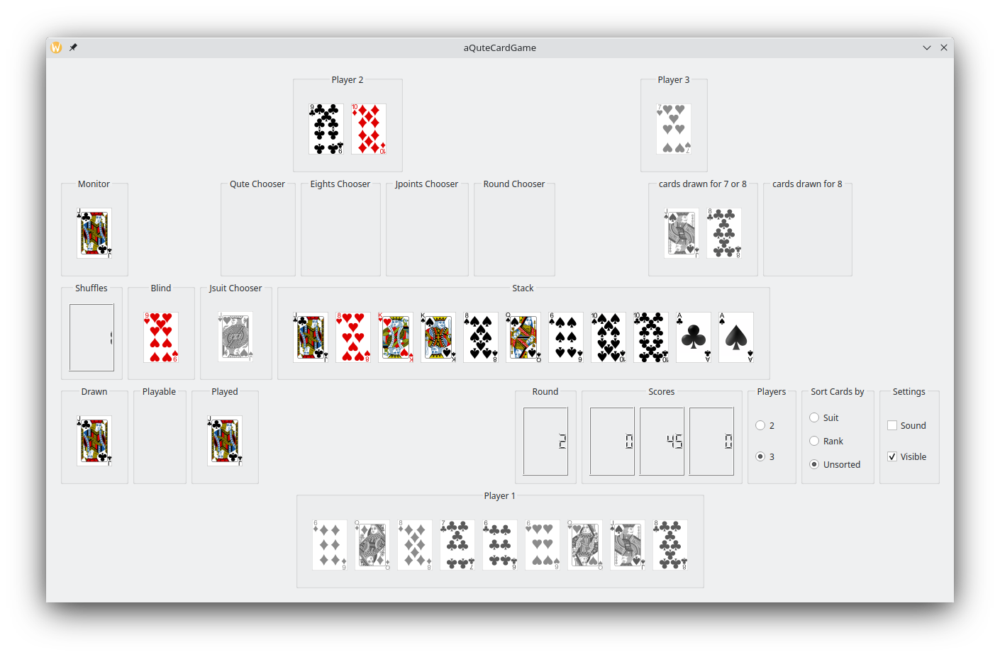
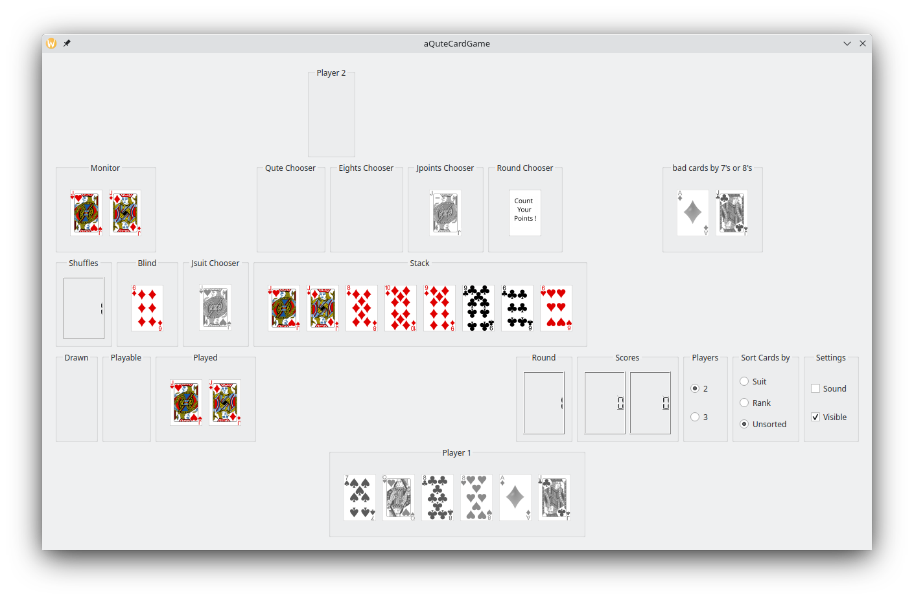
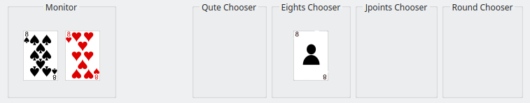
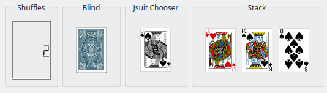
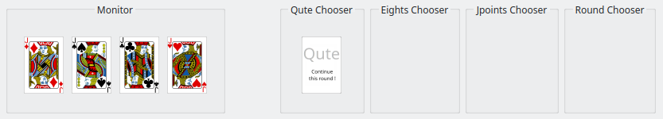

# Card Game

This card game is played with 36 cards, consisting of 4 suits {"♦", "♠", "♥", "♣"} and ranks {"6", "7", "8", "9", "10", "J", "Q", "K", "A"}. 
The game is can be played by 2 or 3 players. Player 1 competes against 1 or 2 AI players. 
Below is a description of the gameboard layout, detailed rules, and game control instructions.

## Gameboard Layout

1. **First Row**: Displays the 2 opponent AI players (Player 2 and Player 3).
2. **Second Row**: Contains the Monitor (shows cards of the same rank played in sequence), various choosers (Qute Chooser, Eights Chooser, Jpoints Chooser and Round Chooser), and panels for cards drawn due to 'Bad cards' ('7' or '8').
3. **Third Row**: Includes the Shuffles counter (indicates how often the blind was refilled and shuffled), the Blind (shows the top card of the draw pile), the JsuitChooser (to choose which suit follows a 'J'), and the Stack (recently played cards).
4. **Fourth Row**: Indicators for cards drawn (except cards drawn for '7's and '8's) (Drawn), playable cards that fit to the actual card on the stack (Playable), cards played by the current player (Played). Further this row contains an indicator for the rounds played, and the player scores.
5. **Bottom Row**: Contains your own hand of cards.

### Layout with card faces of opponent players visible (3 players):

<!-- Page break -->

### Layout with card faces of opponent players not visible (2 players):

## Game Rules

### Starting the Game
- **Initial Setup**: Each player starts with 5 cards.
- **First Move**: Player 1 plays a card onto the stack and can add more cards of the same rank. 
The next player must play a card of the same suit or rank and may add more cards of the same rank.

### Playing a Turn
- **Using Hand Cards**: Players must use their hand cards and play at least one card.
- **Drawing from the Blind**: If no suitable card is in hand, draw one card from the blind. 
This card can be played if it matches the card on the stack; otherwise, the turn passes to the next player.

### Special Conditions
- **Drawing Cards**: Only one card can be drawn from the blind, except when covering a '6'.
- **Covering a '6'**: Must be covered by a different rank. 
If no suitable card is in hand, draw cards from the blind until a non-'6' card can be played. 
The 'Qute' condition (four cards of the same rank played in sequence) overrides this rule,
allowing the player to either end the round or cover the fourth '6' with another rank.

### Special Cards
- **6**: Must be covered by a different rank. Draw cards until this is possible.
- **7**: The next player must draw one card from the blind.
- **8**: The next player must draw 2 cards and is skipped. 
Multiple '8's can force the next player to draw more cards or distribute the draws among players. 
This is decided using the 'Eights Chooser'.
- **J**: Can be played on any suit, and the player chooses the suit to follow using the 'JsuitChooser'.
- **A**: The next player is skipped. Multiple Aces skip sequential players.

<!-- Page break -->

### 'Qute' Condition
When four cards of the same rank are played in sequence (by different players), the player who plays the fourth card can choose to end the round or continue. 
For '6's, this overrides the 'must be covered' rule.

## Scoring
- **End of Round**: Scoring occurs when a player has no more cards or a 'Qute' is announced.

### Card Values:
- 6, 7, 8, 9: 0 points
- 10, Q, K: 10 points
- J: 20 points (-20 or +20 when finishing with 'J')
- A: 15 points

### Special Scoring Rules:
- **125 Points**: A player's score resets to 0 if they reach exactly 125 points.
- **Finishing with 'J'**: The player can choose to either reduce their score by 20 points per 'J' or increase opponent scores by 20 points per 'J', decided via the 'JpointsChooser'.
- **Refilled Blind**: Each refill of the blind multiplies the end-of-round points (doubling, tripling, etc.), including the +/-20 points rule when finishing with 'J'.

## Game Control

### Mouse Controls
- **Click on card**: Play the card onto the stack if it matches.
- **Right Click**: End the current player's turn.
- **Toggle Decisions**: Use the choosers for decisions on multiple '8's, 'Jsuit', 'Jpoints', and 'Qute'.

### Choosers
- **Multiple 8's**: Decide how the draw cards rule for multiple '8's will apply. 
Click on this chooser to toggle between 'all 8s for next player' or 'share the 8s among the following players'. 
(The toggling is disabled when playing against 1 opponent only.)
  - 
  - 

<!-- Page break -->

- **J Suit**: Choose the suit to follow a 'J'. 
Click on this chooser to toggle to the next suit. 
(The order of toggling is {"♦", "♠", "♥", "♣"}.)
  - 

- **J Points**: Choose between increasing scores of opponent players or reducing the score of the active player. 
Click on this chooser to toggle between '+20 points' and '-20 points'.
  - 
  - 

- **'Qute'**: Decide whether to finish or continue the round.
You can finish a round if 4 times 6 is indicated in the 'Monitor' (6♦ 6♠ 6♥ 6♣) and 'Qute' enabled.
If you choose 'Continue' then the last played '6' must be covered. 
Click on this chooser to toggle between 'Qute' (finishing the round) and 'Continue this round'.
  - 
  - 

<!-- Page break -->

### More Controls and Settings
   

- **Players**: you can play against 1 or 2 AI player.
- **Sort Cards by**: arrange handdeck cards by suit or rank.
- **Sound**: enables some sound effects.
- **Visible**: enables the card faces of the opponent players be shown.

### Special Keys
- **F1**: Show the README.md
- **G**: Start a new Game.

###  For Testing
Extra special cards given to the active player: 
- **6, 7, 8, J, A**: Add a corresponding card to the active player's hand. 
- **D**: Move last card in the handdeck of the active player back to the blind. 

Enjoy the game!
