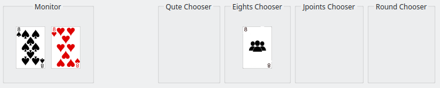
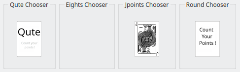
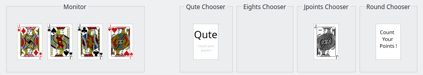

# Card Game

This card game is played with 36 cards, consisting of 4 suits {"♦", "♠", "♥", "♣"} and ranks from {"6", "7", "8", "9", "10", "J", "Q", "K", "A"}. The game is played by 3 players. Player 1 competes against 2 'AI' players. Each player starts with 5 cards. Below is a description of the gameboard layout, detailed rules, and game control instructions.

## Gameboard Layout

1. **First Row**: Displays the 2 opponent 'AI' players ('Player 2' and 'Player 3').
2. **Second Row**: Contains the 'Monitor' (shows cards of the same rank played in sequence), various choosers ('Eights Chooser', 'Qute Chooser', 'Round Chooser', and 'Jpoints Chooser'), and panels for cards drawn due to 'Bad cards' ('7' or '8').
3. **Third Row**: Includes the 'Shuffles' counter (indicates how often the blind was refilled and shuffled), the 'Blind' (shows the top card of the draw pile), the 'JsuitChooser' (to choose which suit follows a 'J'), and the 'Stack' (recently played cards).
4. **Fourth Row**: Indicators for playable cards ('Playable'), cards played by the current player ('Played'), cards drawn (except for '7's and '8's), rounds played, and player scores.
5. **Bottom Row**: Contains your own hand of cards.

## Game Rules

### Starting the Game
- **Initial Setup**: Each player starts with 5 cards.
- **First Move**: Player 1 plays a card onto the stack and can add more cards of the same rank. The next player must play a card of the same suit or rank, and may add more cards of the same rank.

### Playing a Turn
- **Using Hand Cards**: Players must use their hand cards and play at least one card.
- **Drawing from the Blind**: If no suitable card is in hand, draw one card from the blind. This card can be played if it matches the card on the stack; otherwise, the turn passes to the next player.

### Special Conditions
- **Drawing Cards**: Only one card can be drawn from the blind, except when covering a '6'.
- **Covering a '6'**: Must be covered by a different rank. If no suitable card is in hand, draw cards from the blind until a non-'6' card can be played. The 'Qute' condition (four cards of the same rank played in sequence) overrides this rule, allowing the player to either end the round or cover the fourth '6' with another rank.

## Special Cards
- **6**: Must be covered by a different rank. Draw cards until this is possible.
- **7**: The next player must draw one card from the blind.
- **8**: The next player must draw 2 cards and is skipped. Multiple '8's can force the next player to draw more cards or distribute the draws among players. This is decided using the 'Eights Chooser'.
- **J**: Can be played on any suit, and the player chooses the suit to follow using the 'Jsuit Chooser'.
- **A**: The next player is skipped. Multiple Aces skip sequential players.

## 'Qute' Condition
When four cards of the same rank are played in sequence (by different players), the player who plays the fourth card can choose to end the round or continue. For '6's, this overrides the 'must be covered' rule.

## Scoring
- **End of Round**: Scoring occurs when a player has no more cards or a 'Qute' is announced.

### Card Values:
- 6, 7, 8, 9: 0 points
- 10, Q, K: 10 points
- J: 20 points (-20 or +20 when finishing with 'J')
- A: 15 points

### Special Scoring Rules:
- **125 Points**: A player's score resets to 0 if they reach exactly 125 points.
- **Finishing with 'J'**: The player can choose to either reduce their score by 20 points per 'J' or increase opponent scores by 20 points per 'J', decided via the 'JpointsChooser'.
- **Refilled Blind**: Each refill of the blind multiplies the end-of-round points (doubling, tripling, etc.), including the +/-20 points rule when finishing with 'J'.

## Game Control

### Mouse Controls
- **Click on card**: Play the card onto the stack if it matches.
- **Right Click**: End the current player's turn.
- **Toggle Decisions**: Use the choosers for decisions on multiple '8's, 'Jsuit', 'Jpoints', and 'Qute'.

### Choosers
- **Multiple 8's**: Decide how the draw cards rule for multiple '8's will apply.
  - 
  - 
- **J Suit**: Choose the suit to follow a 'J'.
  - 
- **J Points**: Choose between increasing scores of opponent players or reducing score of active player.
  - 
  - 
- **'Qute'**: Decide whether to finish or continue the round.
  - 
  - 

### Special Keys (Testing Mode)
- **v**: Toggle visibility of other players' cards.
- **6, 7, 8, J, A**: Add a corresponding card to the active player's hand.

Enjoy the game!
